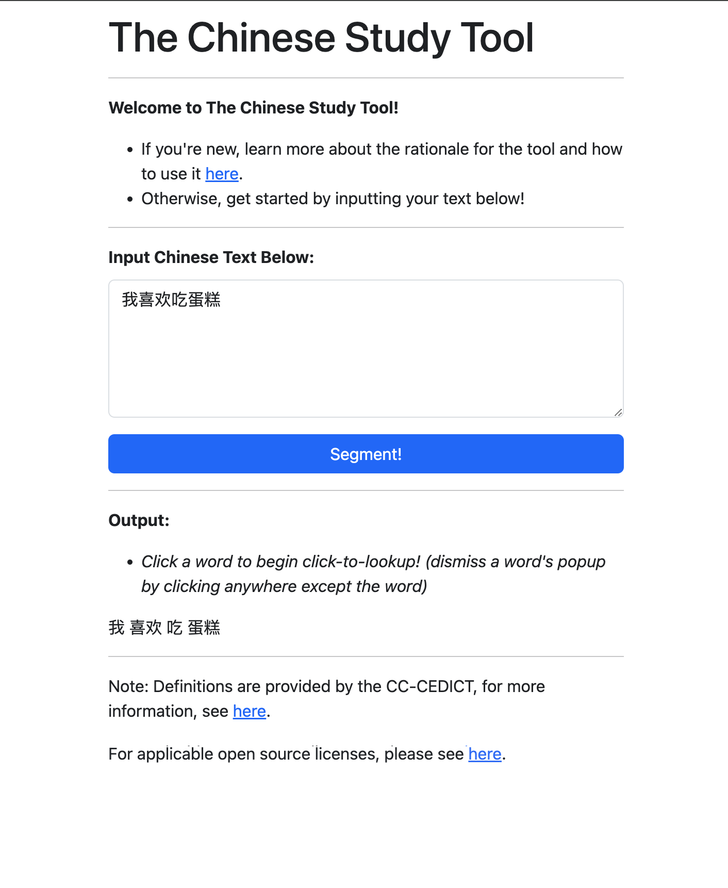

# The Chinese Study Tool
**Try out the app here! https://aal451.github.io**

Click [here](#how-does-the-tool-work) for a quick tutorial on how to use the app!

## What is this app?
This is an app designed to massively speed up the studying of Chinese by streamlining the process of finding dictionary definitions of words one does not know.

Try it out at: https://aal451.github.io

## Why is this tool useful?
One of the greatest impediments to learning Chinese is learning the huge variety in vocabulary used in the language. One way to pick up new vocabulary is to try reading written texts, however, this is impedes the learning process significantly for two reasons:

1. Chinese, unlike English, does not have spaces between words. As a result, it is difficult to determine where one word begins, and where the other ends, so that a word can be looked up and learned.

2. Searching a Chinese-English dictionary often requires inputting the characters into a dictionary using handwriting input (since often, you don't know the phonetic pronunciation of the characters, and thus cannot use the more efficient method of allowing the dictionary to guess the characters based on the pronunciation), which is very time-consuming, especially if you have many characters to look up.

The Chinese Study Tool solves these two pain points for learning Chinese by:

1. Using a natural language processing library called jieba to segment a text of interest into its individual words, which allows you to learn the character combinations that form the Chinese vocabulary you might be intersted in.

2. Allowing you to click on any word of the segmented text to instantly learn its definition (as well as other useful information like its phonetic pronunciation!).

Together, these two conveniences allow you to learn new vocabulary by reading texts much, much faster, keeping you motivated to learn Chinese!

## How does the tool work?
1. First, paste some Chinese text you want to read into the Input Text Box:
    * For example: let's say we want to read: 我喜欢吃蛋糕
    * We would paste it in like so:
    

2. Second, click "Segment!" to generate the segmentation of the text.
    * For example, our example sentence looks like this after clicking "Segment!":
    

3. Third, click on a word you're interested in learning the definition for to get its definition.
    * For example, we wanted to know what "我" means, so we clicked it, and we can see the definition:
    

4. Click anywhere except the word to dismiss the definition popup (even another word!) To look up other words, just click them! Happy learning!

 ## Licensing
 Please see the license.md file in this repository for licensing details.